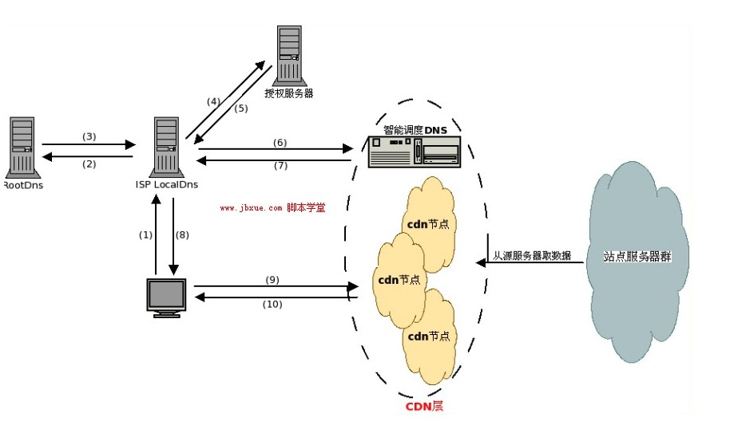
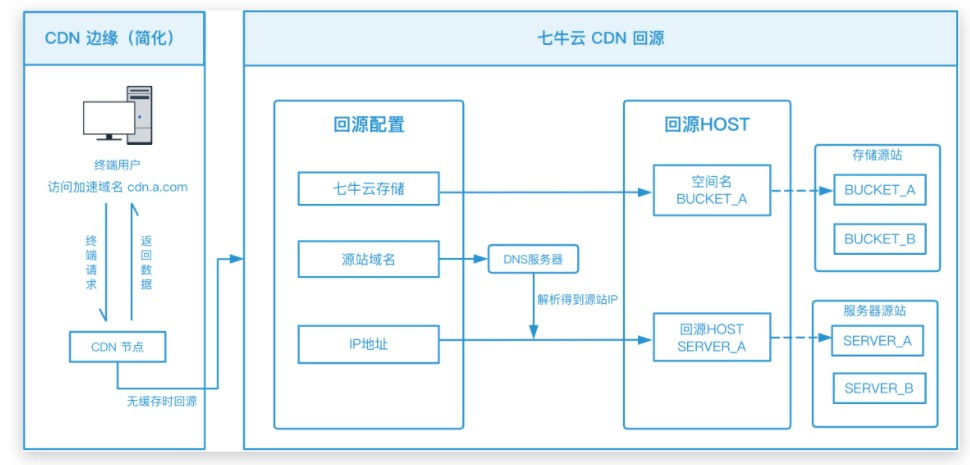

[参考资料](https://blog.csdn.net/xiangzhihong8/article/details/83147542)
[参考资料](https://juejin.cn/post/6854573212425814030)


### 什么是CDN

CDN全称是content delivery network，即内容分发网络，一组分布在各个地区的服务器。
其目的是通过在现有的Internet中增加一层新的网络架构，将网站的内容发布到最接近用户的网络“边缘”，使用户可以就近取得所需的内容，提高用户访问网站的响应速度。
从技术上全面解决由于网络带宽小、用户访问量大、网点分布不均等问题，提高用户访问网站的响应速度。

### 工作原理

- 未使用CDN


- 使用CDN



**CDN网络是在用户和服务器之间增加Cache层，主要是通过接管DNS实现，将用户的请求引导到Cache上获得源服务器的数据，从而降低网络的访问时间。**

### CDN回源原理


回源：**CDN 发现自己没有这个资源（一般是缓存的数据过期了），转头向根服务器（或者它的上层服务器）去要这个资源的过程。**

- 源站内容有更新的时候，源站主动把内容推送到CDN节点。

- 常规的CDN都是回源的。即：当有用户访问某一个URL的时候，如果被解析到的那个CDN节点没有缓存响应的内容，或者是缓存已经到期，就会回源站去获取。如果没有人访问，那么CDN节点不会主动去源站拿的。

- 回源域名一般是cdn领域的专业术语，通常情况下，是直接用ip进行回源的，但是如果客户源站有多个ip，并且ip地址会经常变化，对于cdn厂商来说，为了避免经常更改配置（回源ip），会采用回源域名方式进行回源，这样即使源站的ip变化了，也不影响原有的配置。


### CDN相关技术

- 负载均衡
- 动态分发与复制技术
- 缓存技术


### 常见概念


源站： 源站决定了回源时，请求到哪个IP

回源host：回源host决定回源请求访问到该IP上的哪个站点

```js
例子：

1、源站是域名

源站为www.a.com，回源host为www.b.com

那么实际回源是请求到www.a.com解析到的IP，对应的主机上的站点www.b.com

 

2、源站是IP

源站为1.1.1.1，回源host为www.b.com

那么实际回源的是1.1.1.1对应的主机上的站点www.b.com
```


- 为什么加速域名和源站域名不能相同？

 一个域名最终只解析到一个位置，即解析到 CDN 加速节点后，将无法用于获取源站的 IP 信息，所以加速域名和源站域名无法配置为同一个域名。