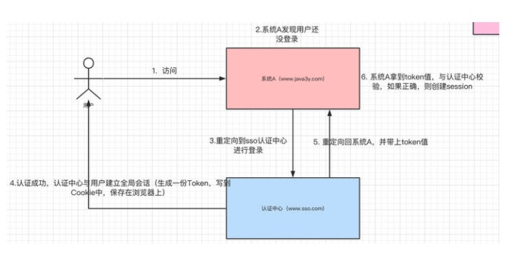

## 名词解释

单点登录英文全称 Single Sign On，简称就是 SSO。它的解释是：在多个应用系统中，只需要登录一次，就可以访问其他相互信任的应用系统。

[参考资料](https://www.jianshu.com/p/75edcc05acfd)
[参考资料](https://github.com/febobo/web-interview/issues/91)

## 流程

用户访问 app 系统，app 系统是需要登录的，但用户现在没有登录。
跳转到 CAS server，即 SSO 登录系统，以后图中的 CAS Server 我们统一叫做 SSO 系统。 SSO 系统也没有登录，弹出用户登录页。
用户填写用户名、密码，SSO 系统进行认证后，将登录状态写入 SSO 的 session，浏览器（Browser）中写入 SSO 域下的 Cookie。
SSO 系统登录完成后会生成一个 ST（Service Ticket），然后跳转到 app 系统，同时将 ST 作为参数传递给 app 系统。
app 系统拿到 ST 后，从后台向 SSO 发送请求，验证 ST 是否有效。
验证通过后，app 系统将登录状态写入 session 并设置 app 域下的 Cookie。
至此，跨域单点登录就完成了。以后我们再访问 app 系统时，app 就是登录的。接下来，我们再看看访问 app2 系统时的流程。

用户访问 app2 系统，app2 系统没有登录，跳转到 SSO。
由于 SSO 已经登录了，不需要重新登录认证。
SSO 生成 ST，浏览器跳转到 app2 系统，并将 ST 作为参数传递给 app2。
app2 拿到 ST，后台访问 SSO，验证 ST 是否有效。
验证成功后，app2 将登录状态写入 session，并在 app2 域下写入 Cookie。

