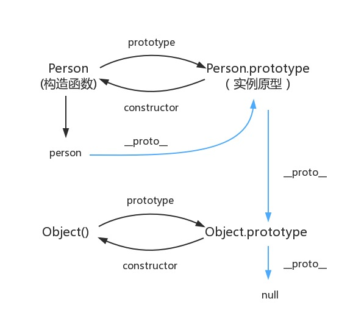

## 构造函数、实例、原型



每个构造函数里都有一个原型对象，每个原型对象都包含指向构造函数的指针，而每个实例都包含一个指向原型对象的内部指针(\***\*proto\*\***)。

有以下定义：

    实例: instance
    原型: Prototype
    构造函数: Func

```js
instance.__proto__ === Prototye;
Prototype.constructor === Func;
Func.prototype.constructor === Func;
// 特别注意
Func.__proto__ === Function.prototype === function () { [native code] }
// 直到顶层
Objcet.prototype.__proto__ === null;
```

instaceof 检测左侧的**proto**是否存在右侧的 prototype。

```js
Function instanceof Object; // ->true
Object instanceof Function; // ->true

Function.__proto__.__proto__ === Object.prototype; //true
Object.__proto__ === Function.prototype; //true
```

1、所有的构造函数的 constructor 都指向**Function (Function() { [native code] })**

2、Function 的 prototype 以及函数实例的**proto**指向一个特殊匿名函数 **function () { [native code] }**，而这个特殊匿名函数的**proto**指向 Object.prototype

## 原型链检测

#### instanceof

instance instanceof Object

**instanceof 运算符用于检测构造函数的 prototype 属性是否出现在某个实例对象的原型链上。构造函数的 prototype！！**

```js
function Car(make, model, year) {
  this.make = make;
  this.model = model;
  this.year = year;
}
const auto = new Car("Honda", "Accord", 1998);

console.log(auto instanceof Car);
// expected output: true

console.log(auto instanceof Object);
// expected output: true

Car.prototype = {};
console.log(auto instanceof Car); // false 构造函数Car的原型对象指向一个空对象,即  auto.__proto__  !== Car.prototype
```

### 一些特殊情况

```js
var simpleStr = "This is a simple string";
var myString = new String();
var newStr = new String("String created with constructor");
var myDate = new Date();
var myObj = {};
var myNonObj = Object.create(null);

simpleStr instanceof String; // 返回 false, 检查原型链会找到 undefined
myString instanceof String; // 返回 true
newStr instanceof String; // 返回 true
myString instanceof Object; // 返回 true

myObj instanceof Object; // 返回 true, 尽管原型没有定义
({} instanceof Object); // 返回 true, 同上
myNonObj instanceof Object; // 返回 false, 一种创建非 Object 实例的对象的方法

myString instanceof Date; //返回 false

myDate instanceof Date; // 返回 true
myDate instanceof Object; // 返回 true
myDate instanceof String; // 返回 false
```

[参考文档](https://developer.mozilla.org/zh-CN/docs/Web/JavaScript/Reference/Operators/instanceof)

#### isPrototypeOf

prototypeObject.isPrototypeOf(object)

**isPrototypeOf() 方法用于测试一个对象是否存在于另一个对象的原型链上。prototypeObj 对象是否存在于 object 的原型链之中。**

```js
function Foo() {}
function Bar() {}
function Baz() {}

Bar.prototype = Object.create(Foo.prototype);
Baz.prototype = Object.create(Bar.prototype);

var baz = new Baz();

console.log(Baz.prototype.isPrototypeOf(baz)); // true
console.log(Bar.prototype.isPrototypeOf(baz)); // true
console.log(Foo.prototype.isPrototypeOf(baz)); // true
console.log(Object.prototype.isPrototypeOf(baz)); // true
```

## Function 与 Object 的关系

**函数也是对象，是对象一个实例。**

fucntion 实例的**proto**指向匿名函数 f(){[native code]}

```js
console.log(f.__proto__ === Function.prototype); // ƒ () { [native code] }  true ;
console.log(Function.__proto__); // ƒ () { [native code] }
console.log(Function.__proto__ === Function.prototype); // true
console.log(Function.__proto__.__proto__ === Object.prototype); // true
console.log(Object.__proto__ === Function.prototype); // true
console.log(Object.prototype.__proto__ === null); // true
console.log(Function.constructor === Function); // true
```

```js
let p = {};
p instanceof Object; // true
p instanceof Function; // false
let f = function () {};
f instanceof Object; // true
f instanceof Function; // true
f.__proto__; //   ƒ () { [native code] }
```

[参考文档](https://www.cnblogs.com/web-record/p/9661804.html)

[参考文档](https://www.cnblogs.com/shuiyi/p/5343399.html)

## instanceOf、isPrototypeOf 区别

instanceOf: 用于检查对象是否是某个构造函数（类型）的实现

isPrototypeOf: 判断是否是某个实例对象的原型对象
